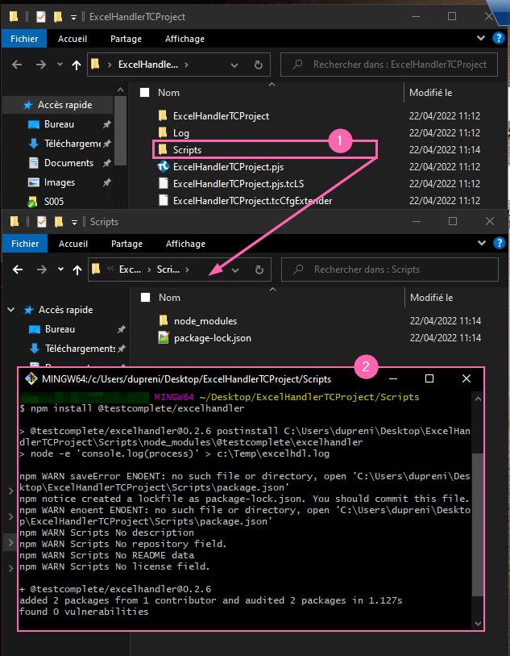
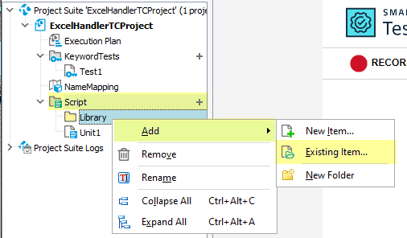
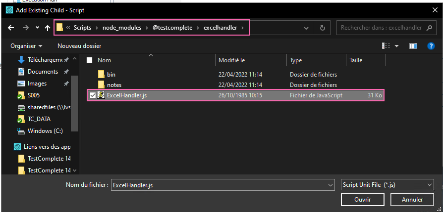
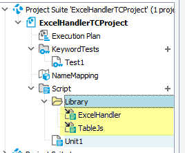
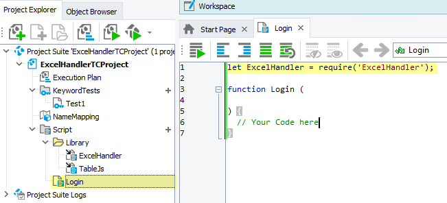

# TestComplete - Library Setup

> The purpose of this package standing only for documentation.

When your libary is available on **npmjs**,
you can easily get library with the following command
if you have **nodejs** installed on your computer.

````bash
npm install @testcomplete/<packageName>
````

**npm** installs the package with it dependencies locally in the folder
where you type the command.

I advise to create a dedicated folder for your scripts libraries (Lib & Functions)



In **TestComplete**, you will have to add the all files (Library & Dependancies)
to your project to be able **require** them in your scripts.

File are specified in the library documentation.

Exemple for **ExcelHandler** :

* [Dependency] : ``./node_modules/@neooblaster/tablejs/Bin/Table.js``
* [Package] : ``./node_modules/@testcomplete/excelhandler/ExcelHandler.js``







Once files (Library and its dependencies) are added in **TestComplete**,
now you are able to required library **ExcelHandler** in any scripts.

**Note** : You can see a little black arrow on each script indicating the script is
in reference of and not owned by the project.

**Important** : In date of 10/05/2022 (TC 14 & 15), 
adding scripts in your script folder **WILL NOT BE ** appended
to your **TestComplete** project.
So you will have to manually add scripts.



Here for **ExcelHandler**, 
you do not have to require ``TableJs``,
because ``ExcelHandler`` does itself.
This rule is true for all libraries and their dependencies.
